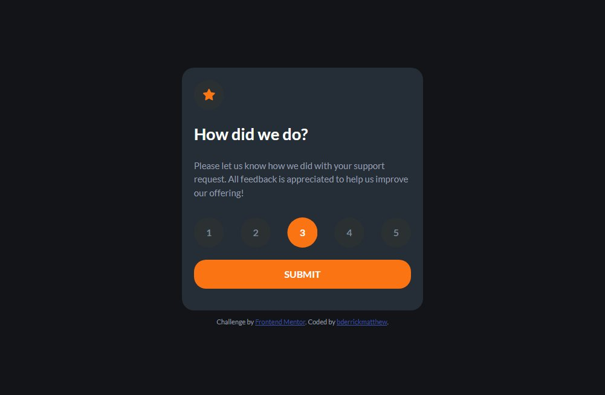
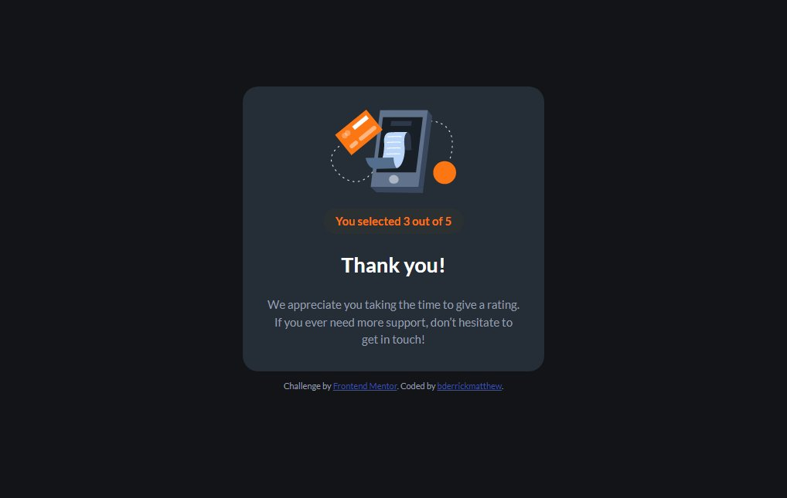

# Frontend Mentor - Interactive rating component solution

This is a solution to the [Interactive rating component challenge on Frontend Mentor](https://www.frontendmentor.io/challenges/interactive-rating-component-koxpeBUmI). Frontend Mentor challenges help you improve your coding skills by building realistic projects. 

## Table of contents

- [Overview](#overview)
  - [The challenge](#the-challenge)
  - [Screenshot](#screenshot)
  - [Links](#links)
- [My process](#my-process)
  - [Built with](#built-with)
  - [What I learned](#what-i-learned)
  - [Continued development](#continued-development)
  - [Useful resources](#useful-resources)
- [Author](#author)
- [Acknowledgments](#acknowledgments)


## Overview

### The challenge

Users should be able to:

- View the optimal layout for the app depending on their device's screen size
- See hover states for all interactive elements on the page
- Select and submit a number rating
- See the "Thank you" card state after submitting a rating

### Screenshot




### Links

- Solution URL: [Github](https://github.com/bderrickmatthew/interactive-rating-component-main)
- Live Site URL: [Github Pages](https://your-live-site-url.com)

## My process

### Built with

- Semantic HTML5 markup
- CSS custom properties
- Flexbox
- CSS Grid
- Mobile-first workflow

### What I learned

I learnt how to use javascript to add a CSS class to an element and remove the CSS class from the element.

I also learnt how to add an active state to one element at a time while (n) elements are having the hover state, in the code below;
```js
//loop through the buttons and add the active class to the current/clicked button
nums.forEach(num => {
        num.addEventListener("click", function () {
          nums.forEach(element => {
            element.classList.remove("bg_active");
            element.classList.add("num");
          });
          this.classList.add('bg_active');
          this.classList.remove('num');

          //store the value of each button
          const value = num.innerText;
          //console.log(value);
          changeState(value);
        });
      });
```


### Continued development

I look forward to focusing on javascript and DOM manipulation in the upcoming weeks

### Useful resources
- Javascript Offline Documentation using Zeal.

## Author

- Website - [Coming Soon...]()
- Frontend Mentor - [@bderrickmatthew](https://www.frontendmentor.io/profile/bderrickmatthew)
- Twitter - [@bderrickmatthew](https://www.twitter.com/bderrickmatthew)


## Acknowledgments

Nah, It was just me and a "higher power"!
